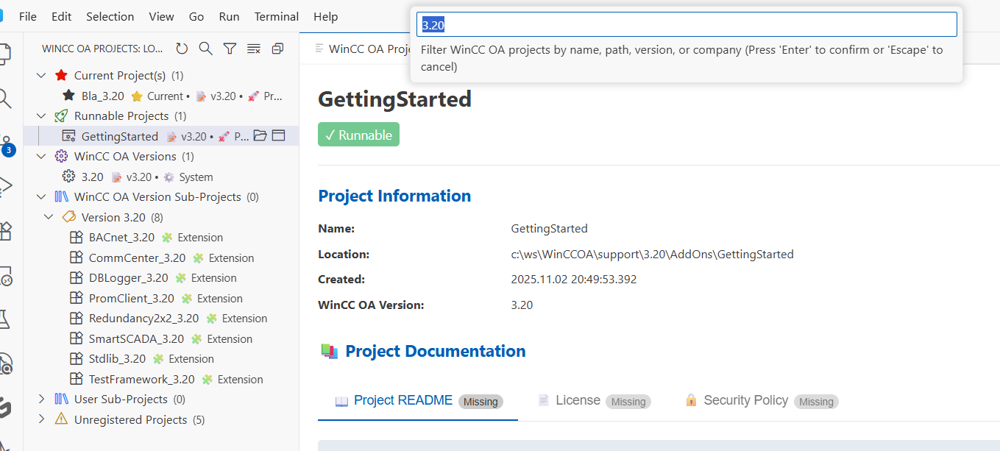
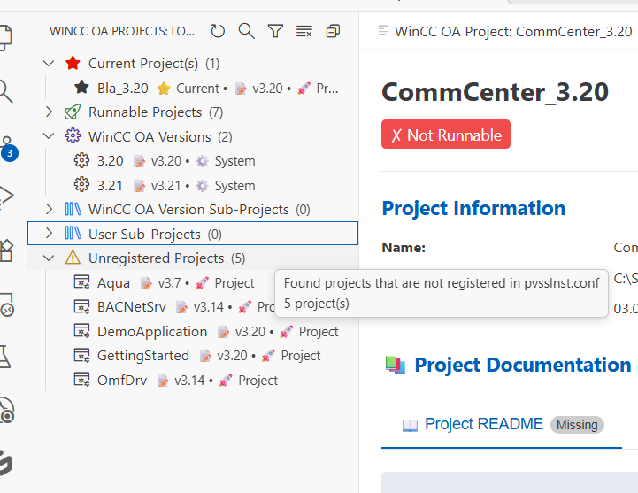
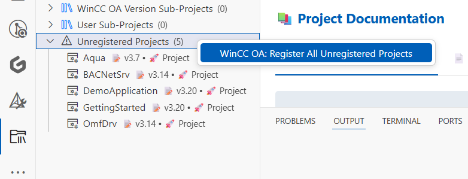
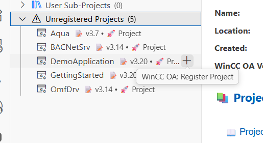
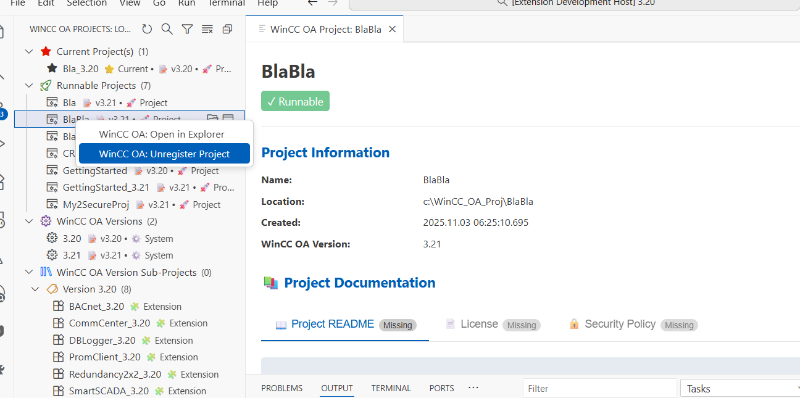
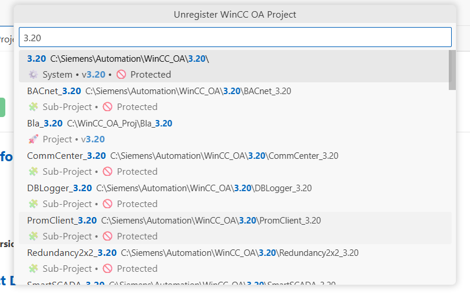

# WinCC OA Projects Viewer

[](https://github.com/mPokornyETM/vs-code-wincc-oa-projects-viewer/releases/latest)
[](https://marketplace.visualstudio.com/items?itemName=mPokornyETM.wincc-oa-projects)
[](https://marketplace.visualstudio.com/items?itemName=mPokornyETM.wincc-oa-projects)
[](https://github.com/mPokornyETM/vs-code-wincc-oa-projects-viewer/actions)
[](https://github.com/mPokornyETM/vs-code-wincc-oa-projects-viewer/blob/main/LICENSE)
[](https://github.com/mPokornyETM/vs-code-wincc-oa-projects-viewer)
[](https://github.com/mPokornyETM/vs-code-wincc-oa-projects-viewer/blob/main/CONTRIBUTING.md)
[](https://www.typescriptlang.org/)

A comprehensive Visual Studio Code extension for viewing, managing, and organizing [SIMATIC WinCC Open Architecture](https://www.winccoa.com/index.html) projects with intelligent categorization and cross-platform support.

**Keywords:** WinCC OA, scada, hmi, wincc-oa-project-admin, wincc-oa-engineering, wincc-oa-runtime

---

## Supporting the Project

"Open source" does not mean "includes free support"

You can support the contributor and buy him a coffee.
[](https://www.buymeacoffee.com/mpokornyetm)
Every second invested in an open-source project is a second you can't invest in your own family / friends / hobby.
That's the reason, why supporting the contributors is so important.

Thx very much for supporting us.

---

## ✨ Key Features

### 🏗️ **Hierarchical Project Organization**
- **Intelligent Categorization**: Projects automatically organized into logical categories
- **Version-Based Grouping**: Sub-projects grouped by WinCC OA version (3.20, 3.21, etc.)
- **Smart Separation**: Distinguishes between WinCC OA delivered and user-registered projects
- **Expandable Tree Structure**: Nested categories with project counts and descriptions

### 🚀 **Project Types Supported**

- **Runnable Projects**: Active WinCC OA projects ready for execution
- **WinCC OA System Versions**: Installed WinCC OA system versions (3.20, 3.21, etc.)
- **WinCC OA Version Sub-Projects**: Components delivered with WinCC OA (BACnet, OPC UA, etc.)
- **User Sub-Projects**: Manually registered custom projects and extensions
- **Unregistered Projects**: Projects found but not properly registered

### 🔍 **Advanced Features**

- **Smart Filtering**: Real-time search across all project categories with instant results
- **Project Registration**: Register new runnable projects and sub-projects directly from VS Code
- **Bulk Operations**: Register all unregistered projects with a single command
- **Project Unregistration**: Remove projects from WinCC OA configuration safely

### 🌍 **Cross-Platform Support**
- **Windows**: Full support for standard Siemens installation paths
- **Unix/Linux**: Support for common Unix installation locations
- **Intelligent Path Detection**: Automatically detects WinCC OA installation directories

### 📊 **Rich Project Information**
- **Visual Status Indicators**: ⭐ Current, 🚀 Runnable, ⚙️ System, 🏷️ Version
- **Detailed Metadata**: Name, location, version, creation date, company info
- **Smart Tooltips**: Context-aware information and project counts
- **Real-time Updates**: Auto-refresh when configuration files change
- **Version Intelligence**: Automatic WinCC OA version detection (3.17-3.20 supported, 3.21 ready)

---

## 🏗️ Project Organization & Tree Structure

The extension organizes projects into a hierarchical tree structure with intelligent categorization:

### 📂 **Root Categories**

```
📁 WinCC OA Projects Viewer
├── ⭐ Current Project(s) (Currently active projects per WinCC OA version)
│   ├── TfCustomized (v3.21)
│   └── Bla_3.20 (v3.20)
├── 🚀 Runnable Projects (Active WinCC OA projects)
├── ⚙️ WinCC OA System Versions (Installed versions: 3.20, 3.21, etc.)
├── 🏭 WinCC OA Version Sub-Projects (Delivered by WinCC OA installation)
│   ├── 🏷️ Version 3.20
│   │   ├── BACnet_3.20
│   │   ├── OPC_UA_3.20
│   │   └── Modbus_3.20
│   └── 🏷️ Version 3.21
│       ├── BACnet_3.21
│       └── OPC_UA_3.21
├── 👤 User Sub-Projects (Manually registered projects)
│   ├── 🏷️ Version 3.20
│   │   └── MyCustomProject
│   └── 🏷️ Version Unknown
│       └── LegacyProject
└── ⚠️ Not Registered (Unregistered projects)
```

### 🎯 **Category Details**

#### ⭐ **Current Project(s)**
- **Purpose**: Shows the currently active project for each WinCC OA version
- **Detection**: Read from `currentProject` entries in WinCC OA version sections of pvssInst.conf
- **Example**: `[Software\ETM\PVSS II\3.21]` section with `currentProject = "TfCustomized"`
- **Features**: One current project per WinCC OA version, priority display with star icon
- **Behavior**: Projects marked as current are excluded from other categories to avoid duplication

#### 🚀 **Runnable Projects**
- **Purpose**: Main WinCC OA projects that can be executed
- **Requirements**: Valid `config/config` file with `[general]` section
- **Status**: Not marked as `notRunnable` in pvssInst.conf
- **Features**: Shows version information, current project indicator

#### ⚙️ **WinCC OA System Versions**  
- **Purpose**: Installed WinCC OA system versions
- **Examples**: 3.20, 3.21, 3.22
- **Detection**: Project name matches version pattern
- **Features**: System installation indicator, version-based sorting

#### 🏭 **WinCC OA Version Sub-Projects**
- **Purpose**: Sub-projects delivered with WinCC OA installation
- **Location**: `C:\Siemens\Automation\WinCC_OA\{version}\`
- **Examples**: BACnet_3.20, OPC_UA_3.21, Modbus_3.20
- **Management**: Managed by WinCC OA installation/updates
- **Organization**: Grouped by version with nested structure

#### 👤 **User Sub-Projects**
- **Purpose**: Manually registered sub-projects and custom extensions
- **Location**: Any path outside WinCC OA installation directories
- **Examples**: Custom projects, third-party extensions, user developments
- **Management**: User-managed via API, manual registration, or tools
- **Organization**: Grouped by detected or unknown version

#### ⚠️ **Not Registered**
- **Purpose**: Projects found but not properly registered in pvssInst.conf
- **Issues**: Missing installation directory or invalid configuration
- **Action Required**: Check project registration or configuration

---

## Configuration File Parsing

The extension reads project information from:

- **Main Config**: `C:\ProgramData\Siemens\WinCC_OA\pvssInst.conf`
- **Project Config**: `<InstallationDir>/config/config` (for version information)

### Project Type Classification

**WinCC OA Projects** (runnable) are identified when:

1. The `notRunnable` property is not set to `true` in the main config
2. A `config` file exists in the `<InstallationDir>/config/` directory
3. The config file contains a `[general]` section with a `proj_version` entry

**WinCC OA Extensions** (non-runnable) include:
- Extensions and plugins
- Add-ons and sub-projects
- Project templates
- Component libraries

- **Project View**: Detailed project information view with comprehensive configuration details
- **Auto-refresh**: Automatically refreshes when `pvssInst.conf` file changes
- **Click to View**: Click any project in the tree to view detailed information
- **Multiple Open Options**: Open projects in current window or new VS Code instance
- **Extension Points**: Provides extension points for other WinCC OA extensions to hook into

---

## 🔌 Extension API

The extension provides a comprehensive API for other extensions to interact with WinCC OA projects:

### **Core Functions**

```typescript
// Get all projects
getProjects(): WinCCOAProject[]

// Find project by path
getProjectByPath(path: string): WinCCOAProject | undefined

// Get project version
getProjectVersion(installationDir: string): string | undefined

// Get cross-platform config file path
getPvssInstConfPath(): string

// Refresh project list
refreshProjects(): void
```

### **Category-Specific Functions**

```typescript
// Get projects by category
getCurrentProjects(): WinCCOAProject[]
getRunnableProjects(): WinCCOAProject[]
getWinCCOASystemVersions(): WinCCOAProject[]
getWinCCOADeliveredSubProjects(): WinCCOAProject[]
getUserSubProjects(): WinCCOAProject[]

// Get current project information
getCurrentProjectsInfo(): CurrentProjectInfo[]

// Get projects by version
getSubProjectsByVersion(version: string): WinCCOAProject[]

// Get category structure
getProjectCategories(): ProjectCategory[]
```

### **Usage Example**

```typescript
// In your extension
import { extensions } from 'vscode';

const winccOAExt = extensions.getExtension('mPokornyETM.wincc-oa-projects');
if (winccOAExt) {
    const api = winccOAExt.exports.getAPI();
    
    // Get current active projects
    const currentProjects = api.getCurrentProjects();
    
    // Get current project information with version details
    const currentProjectsInfo = api.getCurrentProjectsInfo();
    
    // Get all runnable projects (excluding current to avoid duplication)
    const runnableProjects = api.getRunnableProjects();
    
    // Get WinCC OA delivered components
    const deliveredComponents = api.getWinCCOADeliveredSubProjects();
    
    // Get projects for specific version
    const v320Projects = api.getSubProjectsByVersion('3.20');
}
```

---

## 📊 Project View Interface

When you select a project from the tree view, a comprehensive project details panel opens with tabbed interface for easy navigation:


### 📚 **Documentation Support**
- **📖 README**: Project overview and documentation (mandatory)
- **📄 LICENSE**: Licensing information (mandatory) 
- **🔒 SECURITY**: Security policy and guidelines (mandatory)
- **🤝 CONTRIBUTING**: Contribution guidelines (optional)
- **📝 CHANGELOG**: Version history and changes (optional)
- **📋 RELEASE NOTES**: Release information (optional)

### ⚙️ **Configuration Management**  
- **Project Config File**: Main WinCC OA settings with [official documentation links](https://www.winccoa.com/documentation/WinCCOA/latest/en_US/Notes/project_config_file.html)
- **config.level File**: CTRL library and logging settings
- **config.http**: HTTP Server configuration
- **config.redu**: Redundancy settings for high availability
- **config.webclient**: Web client specific settings

### 🔗 **Newcomer-Friendly Features**
- **Official Documentation Links**: Direct access to WinCC OA documentation for each configuration file
- **Missing File Indicators**: Shows "Sorry, the information is missing" for mandatory files
- **Contextual Help**: Descriptions and purposes for each configuration type

---

## 🔍 Smart Filtering

The extension provides powerful real-time filtering to quickly find projects across all categories:



### Filter Features

- **Real-time Search**: Type to instantly filter projects as you type
- **Cross-Category Search**: Searches across all project categories simultaneously
- **Case-Insensitive**: Search works regardless of letter case
- **Partial Matches**: Find projects with partial name matches
- **Category Preservation**: Maintains hierarchical structure while filtering
- **Clear Filter**: Easy reset to show all projects

### How to Use

1. **Open Filter**: Click the filter icon (🔍) in the projects view toolbar
2. **Type Search Term**: Enter project name or partial name
3. **View Results**: See filtered projects with matching categories
4. **Clear Filter**: Click the clear button (✖) or delete all text

---

## 📁 Unregistered Projects Management

The extension automatically discovers projects that exist on your system but aren't properly registered with WinCC OA:



### Unregistered Projects Category

- **Auto-Discovery**: Automatically scans common WinCC OA project locations
- **Smart Detection**: Identifies valid project structures
- **Registration Status**: Shows which projects need attention
- **Bulk Actions**: Register multiple projects at once

### Bulk Registration

Register all discovered unregistered projects with a single command:



- **One-Click Registration**: Register all unregistered projects simultaneously  
- **Validation**: Automatically validates project structure before registration
- **Progress Feedback**: Shows registration progress for multiple projects
- **Error Handling**: Reports any issues during bulk registration

---

## 🔧 Project Registration

### Register Runnable Project

Add new runnable WinCC OA projects to your system:



**Features:**
- **Structure Validation**: Ensures project has required `config/config` file
- **Version Detection**: Automatically extracts WinCC OA version from project files
- **Duplicate Prevention**: Prevents registering already registered projects
- **Path Validation**: Validates project directory structure and accessibility

### Project Unregistration

Remove projects from WinCC OA configuration safely:





**Safety Features:**
- **Confirmation Dialog**: Requires confirmation before unregistering
- **Configuration Backup**: Safely removes entries from WinCC OA configuration
- **Selective Removal**: Unregister individual projects without affecting others
- **Undo Prevention**: Clear warning about permanent removal

---

## 🎮 Commands

### Core Project Management

- **WinCC OA: Refresh Projects**: Manually refresh the project list
- **WinCC OA: Open Project**: Open a project/extension folder in current VS Code window
- **WinCC OA: Open Project in New Window**: Open a project/extension folder in new VS Code instance
- **WinCC OA: Open in Explorer**: Open project/extension location in Windows Explorer
- **WinCC OA: Show Project Details**: Select and display detailed project/extension information

### Project Registration Commands

- **WinCC OA: Register Runnable Project**: Register a runnable WinCC OA project from directory
  - **Context Menu**: Available when right-clicking on directories in the file explorer
  - **Command Palette**: Use folder selection dialog to browse and select project directory
  - **Validation**: Automatically validates project structure (requires `config/config` file)
  - **Version Detection**: Extracts WinCC OA version from project configuration files
  - **Duplicate Check**: Prevents registering already registered projects

- **WinCC OA: Register Sub-Project**: Register a WinCC OA sub-project or extension from directory
  - **Context Menu**: Available when right-clicking on directories in the file explorer
  - **Command Palette**: Use folder selection dialog to browse and select project directory
  - **Structure Validation**: Validates that directory does not contain runnable project structure
  - **Error Prevention**: Suggests using "Register Runnable Project" if config/config file is detected

- **WinCC OA: Register All Unregistered Projects**: Register all discovered unregistered projects
  - **Bulk Operation**: Register multiple projects with a single command
  - **Progress Feedback**: Shows registration progress and results
  - **Error Reporting**: Reports any issues encountered during bulk registration

### Project Unregistration Commands

- **WinCC OA: Unregister Project**: Remove a project from WinCC OA configuration
  - **Context Menu**: Available when right-clicking on registered projects
  - **Safety Confirmation**: Requires user confirmation before removal
  - **Configuration Update**: Safely removes project entries from WinCC OA configuration files
  - **Permanent Action**: Clear warning about permanent removal (no undo)

### Filter and Search Commands

- **WinCC OA: Filter Projects**: Open the project filter input
  - **Real-time Search**: Filter projects as you type
  - **Cross-category**: Search across all project categories
  - **Clear Filter**: Reset to show all projects

---

## Usage

1. Install the extension
2. Look for "WinCC OA Projects" in the activity bar (left sidebar)
3. Click to open the "Locale Projects" view
4. Browse your WinCC OA projects with all relevant information displayed
5. Right-click on projects for context menu options

---

## Requirements

### System Requirements
- **Operating System**: Windows (primary), Linux/Unix (supported)
- **WinCC OA Installation**: Properly configured WinCC OA projects
- **File Access**: Access to `C:\ProgramData\Siemens\WinCC_OA\pvssInst.conf` (Windows) or `/etc/opt/pvss/pvssInst.conf` (Unix)

### Supported WinCC OA Versions

#### ✅ **Fully Supported Versions**
- **WinCC OA 3.20** - Latest stable version with complete feature support and optimization
- **WinCC OA 3.19** - Stable version with full compatibility and testing
- **WinCC OA 3.18** - Legacy support with core functionality maintained
- **WinCC OA 3.17** - Legacy support with essential features available

#### 🚀 **Upcoming Versions**
- **WinCC OA 3.21** - Coming soon! Extension prepared for future compatibility

#### 🔍 **Intelligent Version Detection**
The extension provides smart version detection through multiple methods:
- **Configuration Files**: Automatic version extraction from `config/config` files
- **Installation Paths**: Pattern matching in directory structures (`/3.20/`, `/3.19/`)
- **Project Naming**: Version detection from project names (`Project_v3.20`, `Demo_3.19`)
- **Registry Integration**: Windows registry version information parsing
- **System Scanning**: Detection of installed WinCC OA system versions

#### 📊 **Version-Aware Features**
- **Smart Categorization**: Automatic grouping by detected WinCC OA version
- **Multi-Version Support**: Handle multiple WinCC OA versions simultaneously
- **Version-Specific Validation**: Compatibility checks based on detected versions
- **Legacy Project Support**: Backwards compatibility with older project formats
- **Future Compatibility**: Extensible architecture for upcoming WinCC OA versions

---

## Development

### For Contributors

If you want to contribute to this project:

1. **Fork the Repository**
   - Click the "Fork" button on GitHub to create your own copy
   - Clone your fork: `git clone https://github.com/YOUR_USERNAME/vs-code-wincc-oa-projects-viewer.git`

2. **Follow Git Flow Workflow** 

   **🌳 This project uses [Git Flow](docs/GITFLOW_WORKFLOW.md) branching model:**

   ```bash
   # For features: branch from develop
   git checkout develop
   git pull upstream develop
   git checkout -b feature/your-feature-name
   
   # For hotfixes: branch from main
   git checkout main
   git pull upstream main  
   git checkout -b hotfix/critical-fix
   ```

   **📖 Complete workflow guide: [docs/GITFLOW_WORKFLOW.md](docs/GITFLOW_WORKFLOW.md)**

3. **Set Up Development Environment**

   ```bash
   # Install dependencies
   npm install

   # Compile TypeScript
   npm run compile

   # Watch for changes during development
   npm run watch

   # Run tests
   npm test
   
   # Run tests with coverage
   npm run test:coverage
   
   # Generate coverage report only
   npm run coverage
   ```

4. **Testing and Quality Assurance**

   ```bash
   # Run linting
   npm run lint
   
   # Run all tests
   npm test
   
   # Run tests with coverage report
   npm run test:coverage
   ```
   
   **Coverage Requirements:**
   - All new code must maintain or improve the current coverage baseline (≥1.5%)
   - The CI/CD pipeline enforces coverage thresholds - no regressions allowed
   - Coverage reports are automatically generated and uploaded as artifacts
   - View detailed coverage reports in the `coverage/lcov-report/` directory

5. **Make Your Changes**
   - Follow the coding standards
   - Add tests for new functionality
   - Update documentation as needed
   - Ensure all tests pass and coverage requirements are met

6. **Verify CI/CD Requirements**
   
   All PRs must pass mandatory automated checks:
   ```bash
   # ✅ Required local verification before PR
   npm run lint      # Linting must pass
   npm run compile   # TypeScript compilation must succeed
   npm test          # All tests must pass (166/166)
   ```
   
   **Mandatory CI/CD Status Checks:**
   - `test (18.x)` - Node.js 18.x compatibility
   - `test (20.x)` - Node.js 20.x compatibility  
   - `package` - Extension packaging validation

7. **Submit Your Contribution**

   ```bash
   # Commit your changes
   git add .
   git commit -m "feat: add your feature description"
   
   # Push to your fork
   git push origin feature/your-feature-name
   ```
   
8. **Create Pull Request**
   - Go to your fork on GitHub
   - Click "New Pull Request"
   - Select `main` as the base branch
   - Provide detailed description of your changes

### 📋 **Contributor Resources**

- **[Detailed Workflow Guide](docs/CONTRIBUTOR_WORKFLOW.md)**: Complete step-by-step contribution process
- **[Contributing Guidelines](CONTRIBUTING.md)**: Code standards and project guidelines
- **Quick Setup Scripts**:
  - **Linux/macOS**: `./scripts/create-feature-branch.sh feature/your-feature-name`
  - **Windows**: `.\scripts\create-feature-branch.ps1 feature/your-feature-name`

### 🤖 Automated Dependency Management

This project uses **Dependabot** to automatically manage dependencies:

- **Weekly updates** every Monday at 9:00 AM CET
- **Security updates** get high priority  
- **Automatic releases** for dependency updates
- **Grouped PRs** for related dependencies

See [DEPENDABOT.md](DEPENDABOT.md) for complete configuration details.

### Debugging

Press `F5` to launch a new VS Code window with the extension loaded for testing.

---

## Project Structure

```text
├── src/
│   ├── extension.ts          # Main extension logic
│   └── test/                 # Test files
├── .vscode/                  # VS Code configuration
├── package.json              # Extension manifest
└── README.md                 # This file
```

---

## 📸 Visual Documentation

The extension includes comprehensive visual documentation with screenshots showing all major features:

### Available Screenshots
- **Project Tree Filter** (`docs/images/proj-tree-filter.png`) - Smart filtering interface
- **Unregistered Projects** (`docs/images/proj-tree-unregistered-projects-.png`) - Auto-discovery of unregistered projects  
- **Register Runnable Project** (`docs/images/proj-tree-register-runnable-project.png`) - Project registration interface
- **Register All Projects** (`docs/images/proj-tree-register-all.png`) - Bulk registration functionality
- **Unregister Project Menu** (`docs/images/proj-tree-item-unregister-project.png`) - Context menu unregistration
- **Unregister Command** (`docs/images/command-unregister-project.png`) - Command palette unregistration
- **Project Documentation View** (`docs/images/project-view-documentation.png`) - Comprehensive project details

See the [User Guide](docs/USER_GUIDE.md) for detailed explanations of each feature.

## Version History

See [CHANGELOG.md](CHANGELOG.md) for version history and changes.

---

## License

This project is licensed under the **MIT License** - see the [LICENSE](LICENSE) file for details.

**note** This project provide interface to WinCC OA and does not iunclude any license to use WinCC OA for free.


### MIT License Summary

- ✅ **Commercial use** - You can use this software for commercial purposes
- ✅ **Modification** - You can modify the source code
- ✅ **Distribution** - You can distribute the original or modified software
- ✅ **Private use** - You can use the software for private purposes
- ⚠️ **Limitation** - The software is provided "as is" without warranty
- ⚠️ **License notice** - Include the original license notice in distributions

---

## Support

For issues, feature requests, or questions:

1. Check the existing issues on GitHub
2. Create a new issue with detailed information
3. Include sample log files if relevant (remove sensitive data)

---

## Acknowledgments

- Built for the WinCC OA community
- Inspired by the need for better log analysis tools
- Thanks to the VS Code extension development community
- Thanks to the Copilot to write this extension

---

**Note**: This extension is designed specifically for WinCC OA log files. For other log formats, consider using alternative log viewing extensions.

**Note**: The most content of this extension was automatically generated by AI (Copilot && Cloaude Sonnet 4)
