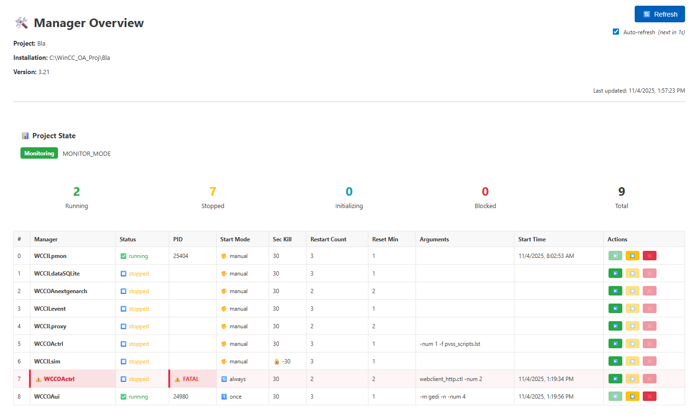
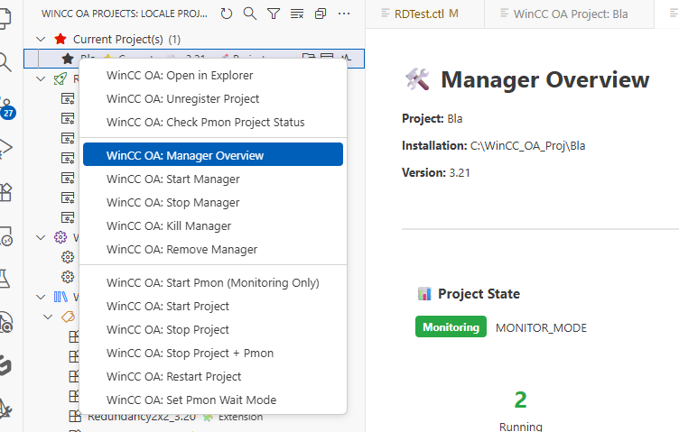
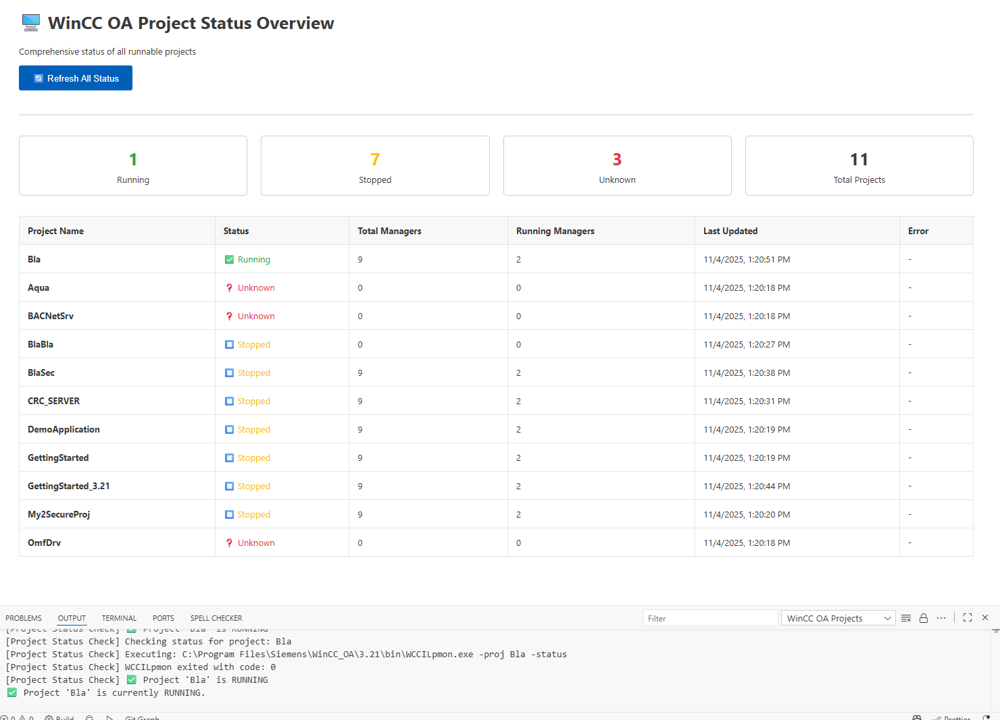

# WinCC OA Projects Viewer

> **The Ultimate Visual Studio Code Extension for SIMATIC WinCC Open Architecture Project Management**

---

## Transform Your WinCC Development Experience

**Stop switching between multiple tools.** Manage all your [SIMATIC WinCC Open Architecture](https://www.winccoa.com/) projects directly from Visual Studio Code with intelligent project organization, real-time status monitoring, and powerful automation features.

### Key Benefits

- **Smart Project Organization** - Automatically categorizes and organizes your projects
- **Real-Time Monitoring** - Live project status with health assessment
- **Built-in Management** - Register, unregister, start/stop projects instantly
- **Rich Visualizations** - Beautiful project trees with status indicators
- **Cross-Platform** - Works seamlessly on Windows and Unix/Linux

---

## Screenshots

### Project Tree Overview

_Intelligent project categorization with visual status indicators and filtering_

### Manager Status Dashboard

_Live monitoring of WinCC OA managers with health scoring and performance metrics_

### Project Control Actions

_Comprehensive project control directly from VS Code_

### Project Health Assessment

_Bird's-eye view of all your runnable projects with health assessment_

### Project Documentation

_Markdown support for standard documentation pages_

### Project Commands

_Useful commands to interact with WinCC OA projects_

---

## Top Features

### Intelligent Organization

- **Smart Categorization**: Projects automatically organized by type and status
- **Version-Based Grouping**: Sub-projects grouped by WinCC OA version (3.17-3.21+)
- **Visual Status Indicators**: Current | Runnable | System | Version | Unregistered
- **Expandable Tree Structure**: Clean, nested view with project counts

### Real-Time Monitoring

- **Live Status Updates**: Real-time project and manager status monitoring
- **Health Assessment**: Comprehensive scoring system (A-F grades)
- **Performance Metrics**: Manager restart counts, uptime tracking
- **Status Dashboard**: Overview of all runnable projects at a glance

### Powerful Management

- **One-Click Registration**: Register projects and sub-projects instantly
- **Bulk Operations**: Register all unregistered projects with single command
- **Safe Unregistration**: Remove projects from configuration safely
- **Project Control**: Start, stop, restart projects directly from VS Code

### Advanced Search & Filtering

- **Real-Time Search**: Instant filtering across all project categories
- **Smart Filters**: Filter by project type, status, or version
- **Quick Navigation**: Jump to specific projects effortlessly

### Code Formatting

- **CTRL Code Formatting**: Format WinCC OA .ctl files using astyle.exe
- **Auto-Detection**: Automatically finds astyle.exe from WinCC OA installation
- **Custom Configuration**: Use WinCC OA's astyle.config or provide your own
- **Flexible Formatting**: Format single files or entire folders recursively
- **Extension-less Files**: Supports formatting files without .ctl extension
- **Output Panel**: View detailed formatting logs in VS Code OUTPUT
- **No Backup Clutter**: Optionally disable .orig backup files (recommended with source control)

---

## Installation & Quick Start

### Install from VS Code Marketplace

1. Open Visual Studio Code
2. Go to Extensions (Ctrl+Shift+X)
3. Search for "**WinCC OA Projects**"
4. Click **Install**
5. The extension activates automatically!

### First Steps

1. **Open Activity Bar** - Look for the WinCC OA Projects icon
2. **View Projects** - Your projects automatically appear in the tree
3. **Filter Projects** - Use the search box to find specific projects
4. **Manage Projects** - Right-click any project for management options

---

## Requirements

- **VS Code**: Version 1.105.0 or higher
- **WinCC OA**: Version 3.17 or higher (3.21 ready)
- **Operating System**: Windows, Linux, or Unix
- **Permissions**: Read/write access to WinCC OA installation directory

---

## Supporting the Project

> "Open source" doesn't mean "includes free support"

If this extension saves you time and makes your WinCC OA development more productive, consider supporting the maintainer:

Every contribution helps maintain and improve this extension for the entire WinCC OA community!

---

## Documentation & Resources

### User Guides

- [User Guide](docs/USER_GUIDE.md) - Complete feature walkthrough
- [CTRL Code Formatting](docs/CTL_CODE_FORMATTING.md) - Code formatting documentation
- [Development Guide](docs/development/DEVELOPMENT.md) - Contributing and development setup
- [Project Management](docs/PMON_MANAGEMENT.md) - Advanced project control features

### Technical Documentation

- [Changelog](docs/project-management/CHANGELOG.md) - Version history and updates
- [Contributing](docs/development/CONTRIBUTING.md) - How to contribute to the project
- [Security Policy](docs/SECURITY.md) - Security guidelines and reporting

### WinCC OA Resources

- [Official WinCC OA Documentation](https://www.winccoa.com/documentation/)
- [SIMATIC WinCC OA](https://www.winccoa.com/index.html) - Official product page

---

## License & Legal

This project is licensed under the [MIT License](LICENSE).

**Disclaimer**: This is an independent community project and is not officially affiliated with Siemens AG or the WinCC OA product team.

---

## Issues & Feature Requests

Found a bug or have a feature idea? We'd love to hear from you!

- [Report Bug](https://github.com/mPokornyETM/vs-code-wincc-oa-projects-viewer/issues/new?template=bug_report.md)
- [Request Feature](https://github.com/mPokornyETM/vs-code-wincc-oa-projects-viewer/issues/new?template=feature_request.md)
- [Join Discussion](https://github.com/mPokornyETM/vs-code-wincc-oa-projects-viewer/discussions)

---

Made with ❤️ for the WinCC OA Community

