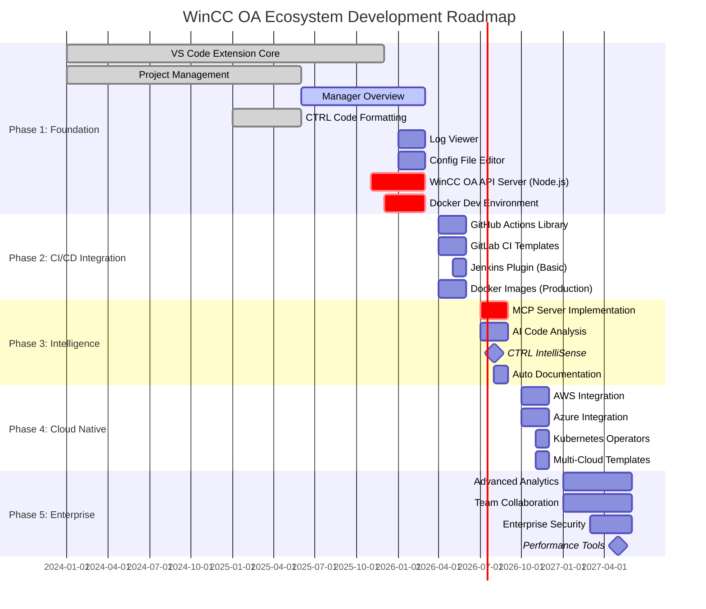

# WinCC OA Ecosystem - Development Roadmap

> **Visual timeline of major features and milestones across the entire WinCC OA development ecosystem**

---

## 📅 Phase 1: Foundation (Q4 2025 - Q1 2026)

**Goal**: Establish core development tools and API infrastructure

### VS Code Extension - Core Features ✅ In Progress

- [x] Project discovery and management
- [x] Manager overview and control
- [x] CTRL code formatting
- [ ] #52 Integrated log viewer
- [ ] #49 Config file editor
- [ ] #47 Pmon authentication
- [ ] #50 Emergency mode status
- [ ] #51 Demo license information

### WinCC OA API Server 🚀 Starting

- [ ] Node.js REST API implementation
- [ ] Project operations endpoints
- [ ] Manager control API
- [ ] Test execution API
- [ ] Authentication & rate limiting
- [ ] Free tier + licensing model

### Docker Environment 🚀 Starting

- [ ] Base WinCC OA images (3.19, 3.20, 3.21)
- [ ] Development environment setup
- [ ] Docker Compose templates
- [ ] Multi-version support

**Deliverables**:

- Fully functional VS Code extension v3.0
- Production-ready API server
- Development Docker images
- Basic documentation

---

## 📅 Phase 2: CI/CD Integration (Q2 2026)

**Goal**: Enable automated testing, building, and deployment workflows

### GitHub Actions

- [ ] Package project action
- [ ] Encrypt secure files action
- [ ] Build documentation action
- [ ] Run tests action
- [ ] Static analysis action
- [ ] Quality gate validation
- [ ] Complete workflow examples

### GitLab CI/CD

- [ ] CI/CD templates library
- [ ] Pipeline components
- [ ] Quality gates integration
- [ ] Security scanning
- [ ] Deployment automation

### Jenkins Plugin

- [ ] Core plugin functionality
- [ ] Pipeline steps implementation
- [ ] Quality gates validation
- [ ] Report generation
- [ ] Integration tests

### Docker Production

- [ ] Production-optimized images
- [ ] Multi-stage builds
- [ ] Security hardening
- [ ] Image registry setup

**Deliverables**:

- GitHub Actions marketplace packages
- GitLab CI template repository
- Jenkins plugin v1.0
- Production Docker images

---

## 📅 Phase 3: Intelligence Layer (Q3 2026)

**Goal**: Add AI-powered development assistance and code intelligence

### MCP Server 🎯 Critical Milestone

- [ ] MCP protocol implementation
- [ ] VS Code integration
- [ ] AI context management
- [ ] Interactive operations
- [ ] Auto-start mechanism

### CTRL IntelliSense 🎯 Major Milestone

- [ ] #65 Language server development
- [ ] Syntax highlighting & validation
- [ ] Autocomplete & IntelliSense
- [ ] Go to definition/references
- [ ] Code refactoring support
- [ ] WinCC OA API integration
- [ ] Static code analysis

### Testing & Quality

- [ ] #55 Execute tests for running projects
- [ ] #56 WinCC OA TestFramework integration
- [ ] #57 Dynamic test reporting
- [ ] #58 Code coverage analysis
- [ ] Intelligent test generation

### Documentation

- [ ] #53 Project documentation viewer
- [ ] #54 Auto-generate documentation
- [ ] AI-powered documentation
- [ ] Interactive help system

**Deliverables**:

- MCP Server v1.0
- CTRL Language Server v1.0
- AI-assisted development features
- Comprehensive testing tools

---

## 📅 Phase 4: Cloud Native (Q4 2026)

**Goal**: Enable cloud deployment and management of WinCC OA projects

### AWS Integration

- [ ] ECS/EKS deployment
- [ ] S3 artifact storage
- [ ] Lambda automation
- [ ] CloudWatch monitoring
- [ ] Infrastructure as Code (Terraform)
- [ ] CodePipeline integration

### Azure Integration

- [ ] AKS deployment
- [ ] Azure Blob Storage
- [ ] Azure Functions
- [ ] Application Insights
- [ ] ARM/Bicep templates
- [ ] Azure DevOps pipelines

### Kubernetes

- [ ] WinCC OA operators
- [ ] Helm charts
- [ ] Auto-scaling
- [ ] Service mesh integration
- [ ] Multi-cluster management

### Multi-Cloud

- [ ] Cloud-agnostic templates
- [ ] Cross-cloud deployment
- [ ] Hybrid cloud support
- [ ] Cost optimization tools

**Deliverables**:

- AWS integration modules
- Azure integration modules
- Kubernetes operators
- Multi-cloud documentation

---

## 📅 Phase 5: Enterprise Features (2027)

**Goal**: Advanced enterprise capabilities for teams and organizations

### Collaboration & Teams

- [ ] Multi-user project management
- [ ] Role-based access control
- [ ] Team dashboards
- [ ] Shared configurations
- [ ] Project templates library

### Analytics & Reporting

- [ ] Advanced project analytics
- [ ] Performance profiling
- [ ] Trend analysis
- [ ] Custom reports
- [ ] Business intelligence integration

### Security & Compliance

- [ ] Enterprise authentication (SSO, LDAP)
- [ ] Audit logging
- [ ] Compliance reporting
- [ ] Security scanning
- [ ] Vulnerability management

### Performance Tools 🎯 Major Milestone

- [ ] #63 Performance profiler
- [ ] Bottleneck detection
- [ ] Resource optimization
- [ ] Query analysis
- [ ] Optimization recommendations

### Advanced Features

- [ ] #60 Project template system
- [ ] #61 Health dashboard
- [ ] #62 Bulk operations
- [ ] #64 Remote project management

**Deliverables**:

- Enterprise edition features
- Advanced analytics platform
- Security & compliance tools
- Performance optimization suite

---

## 🎯 Major Milestones

### Milestone 1: Foundation Complete (Q1 2026)

- ✅ VS Code Extension v3.0
- ✅ API Server v1.0
- ✅ Docker Development Environment
- **Success Criteria**: 1,000+ extension installs, 10,000+ API calls

### Milestone 2: CI/CD Ready (Q2 2026)

- ✅ GitHub Actions Library
- ✅ GitLab CI Templates
- ✅ Jenkins Plugin
- **Success Criteria**: 50+ repositories using actions, 100+ Docker pulls/day

### Milestone 3: AI-Powered (Q3 2026)

- ✅ MCP Server v1.0
- ✅ CTRL IntelliSense v1.0
- ✅ Auto-documentation
- **Success Criteria**: 80% code completion accuracy, 5,000+ extension installs

### Milestone 4: Cloud Native (Q4 2026)

- ✅ AWS & Azure Integration
- ✅ Kubernetes Operators
- ✅ Multi-cloud Support
- **Success Criteria**: 20+ cloud deployments, 99.9% uptime

### Milestone 5: Enterprise Ready (Q2 2027)

- ✅ Team Collaboration
- ✅ Advanced Analytics
- ✅ Enterprise Security
- **Success Criteria**: 10+ enterprise customers, 10,000+ extension installs

---

## 📊 Success Metrics by Phase

| Phase   | Extension Installs | API Calls/Month | Docker Pulls | Contributors |
| ------- | ------------------ | --------------- | ------------ | ------------ |
| Phase 1 | 1,000+             | 10,000+         | 1,000+       | 10+          |
| Phase 2 | 3,000+             | 100,000+        | 10,000+      | 25+          |
| Phase 3 | 5,000+             | 500,000+        | 50,000+      | 50+          |
| Phase 4 | 7,500+             | 1,000,000+      | 100,000+     | 75+          |
| Phase 5 | 10,000+            | 2,000,000+      | 250,000+     | 100+         |

---

## 🚀 Current Status (November 2025)

### ✅ Completed

- Project discovery and organization
- Manager overview and control
- Real-time status monitoring
- CTRL code formatting
- Health assessment system
- 366 comprehensive tests
- CI/CD pipeline setup

### 🔄 In Progress

- Enhanced manager overview features (#46)
- Pmon command history merge (#44)
- Manager actions when pmon is down (#45)

### 📋 Planned Next

- WinCC OA API Server prototype
- Docker development environment
- Integrated log viewer
- Config file editor

---

## 🤝 How to Contribute

See [CONTRIBUTING.md](docs/development/CONTRIBUTING.md) for:

- Development setup
- Code standards
- Pull request process
- Issue reporting

---

## 📚 Related Documents

- [📘 Vision Document](VISION.md) - Comprehensive ecosystem vision
- [📖 User Guide](docs/USER_GUIDE.md) - Feature documentation
- [🔧 Development Guide](docs/development/DEVELOPMENT.md) - Technical setup
- [📝 Changelog](docs/project-management/CHANGELOG.md) - Version history

---

**Last Updated**: November 12, 2025  
**Current Phase**: Phase 1 - Foundation  
**Progress**: 45% Complete
