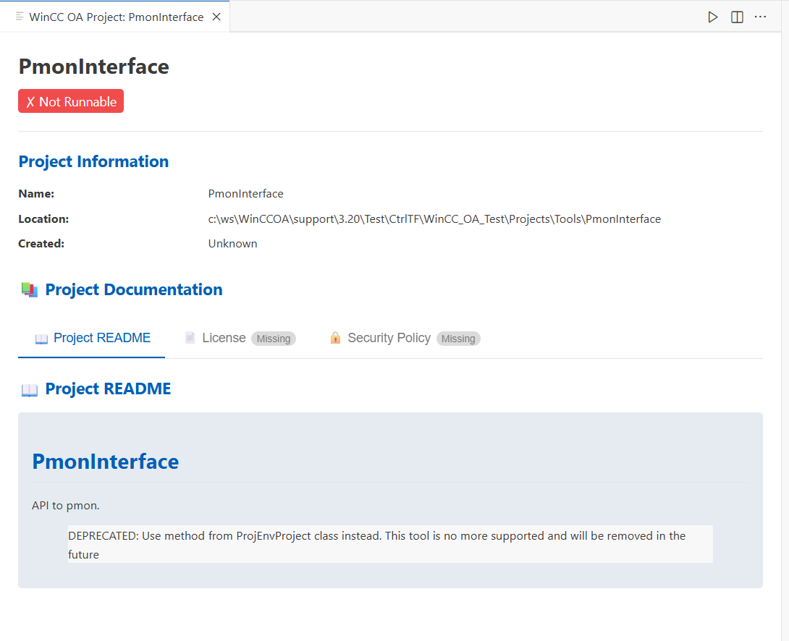

# WinCC OA Projects Extension - User Guide

## Overview

The WinCC OA Projects extension provides a comprehensive view of all your WinCC OA (Open Architecture) projects directly within VS Code. It automatically discovers projects from your system configuration and organizes them into a hierarchical tree structure for easy navigation and management.

## Features

### 📁 Project Discovery

- Automatically scans Windows registry and configuration files
- Discovers all registered WinCC OA projects on your system
- Cross-platform support (Windows and Unix-based systems)

### 🗂️ Hierarchical Organization

Projects are automatically organized into the following categories:

#### 1. **Current Project**

The currently active WinCC OA project (if any)

#### 2. **Runnable Projects**

Projects that are configured and ready to run

- Local projects you've created or imported
- Properly configured project directories

#### 3. **WinCC OA System Versions**

System installations organized by version

- Example: `WinCC OA 3.20`, `WinCC OA 3.21`
- Shows installed system components

#### 4. **WinCC OA Sub-Projects**

Sub-projects delivered with WinCC OA installations

- Organized by version (e.g., `3.20`, `3.21`)
- Includes system examples and templates
- Distinguished from user-created projects

#### 5. **User Sub-Projects**

User-created or manually registered sub-projects

- Organized by version when available
- Your custom project components

#### 6. **Not Registered**

Projects found in directories but not properly registered

- May need manual configuration
- Potential orphaned projects

## Getting Started

### Installation
1. Install the extension from the VS Code Marketplace
2. The extension will automatically activate when VS Code starts

### First Use
1. Open the **Activity Bar** on the left side of VS Code
2. Look for the **WinCC OA Projects** icon (📁)
3. Click to open the projects view
4. The extension will automatically scan for projects

## Using the Extension

### Project Tree View

The main interface is a tree view showing all your projects organized by category:

```
WinCC OA Projects
├── 📍 Current Project
│   └── MyActiveProject
├── 🏃 Runnable Projects (3)
│   ├── Project1
│   ├── Project2
│   └── Project3
├── 🖥️ WinCC OA System Versions
│   ├── WinCC OA 3.20
│   └── WinCC OA 3.21
├── 📦 WinCC OA Sub-Projects
│   ├── 3.20 (5 projects)
│   │   ├── ExampleProject
│   │   └── TemplateProject
│   └── 3.21 (3 projects)
└── 👤 User Sub-Projects
    └── 3.20 (2 projects)
```

### Project View with Documentation Support

When you select a project from the tree view, a detailed project view opens showing comprehensive information including project configuration and documentation:



The project view includes:
- **📚 Project Documentation** - Tabbed interface for README, LICENSE, SECURITY files
- **⚙️ Project Configuration** - Organized tabs for different config files (config, config.level, config.http, etc.)
- **📖 Official WinCC OA Documentation Links** - Direct links to official documentation for each configuration file
- **📋 Mandatory Documentation Validation** - Shows "Sorry, the information is missing" for required files not found
- **🔗 Interactive Links** - Clickable links to official WinCC OA documentation for newcomers

### Context Menu Actions

Right-click on any project to access these actions:

- **Open Project** - Open the project in current VS Code window
- **Open in New Window** - Open the project in a new VS Code window  
- **Open in Explorer** - Open the project directory in file explorer
- **Show Project View** - Focus on the project in the tree view

### Toolbar Actions

- **🔄 Refresh** - Manually refresh the project list
- **⚙️ Settings** - Open extension settings

## Project Information

Each project displays:
- **📁 Project Name** - The project's display name
- **📍 Status Indicators**:
  - ⚡ Current project (active)
  - ✅ Runnable project
  - ⚠️ Not registered
  - 🏗️ Sub-project
- **📊 Version** - WinCC OA version (when available)
- **📂 Path** - Installation directory

## Configuration

### Automatic Detection
The extension automatically detects projects from:
- Windows Registry (`HKEY_LOCAL_MACHINE\SOFTWARE\ETM\PVSS II`)
- Configuration files (`pvssInst.conf`)

### Manual Configuration
If projects aren't detected automatically:
1. Check that projects are properly registered with WinCC OA
2. Verify configuration file locations:
   - Windows: `C:\ProgramData\Siemens\WinCC_OA\pvssInst.conf`
   - Unix: `/etc/opt/pvss/pvssInst.conf`

## Troubleshooting

### No Projects Shown
1. **Check Installation**: Ensure WinCC OA is properly installed
2. **Verify Permissions**: VS Code needs read access to configuration files
3. **Manual Refresh**: Click the refresh button (🔄) in the toolbar
4. **Check Logs**: Open VS Code Developer Tools for error messages

### Missing Projects
1. **Registration**: Ensure projects are registered with WinCC OA
2. **Path Issues**: Verify project directories exist and are accessible
3. **Configuration**: Check `pvssInst.conf` file for project entries

### Performance Issues
1. **Large Project Lists**: The extension handles hundreds of projects efficiently
2. **Network Drives**: Projects on network drives may load slower
3. **Refresh Rate**: Automatic refresh occurs when configuration changes

## API for Developers

The extension provides a comprehensive API for other extensions:

```typescript
// Get the extension API
const winccExtension = vscode.extensions.getExtension('mPokornyETM.wincc-oa-projects');
const api = winccExtension.exports.getAPI();

// Available functions
api.getProjects();                    // All projects
api.getRunnableProjects();            // Only runnable projects  
api.getWinCCOASystemVersions();       // System versions
api.getWinCCOADeliveredSubProjects(); // WinCC OA sub-projects
api.getUserSubProjects();             // User sub-projects
api.refreshProjects();                // Refresh project list
```

## Advanced Features

### Version Detection
The extension automatically detects project versions from:
- Project names (e.g., "MyProject_3.20")
- Installation paths
- Configuration metadata

### Path Classification
Intelligent classification determines project types:
- **System Projects**: Located in WinCC OA installation directories
- **User Projects**: Located in custom directories
- **Sub-Projects**: Nested within other projects

### Cross-Platform Support
- Windows: Registry and `ProgramData` locations
- Linux/Unix: Standard `/etc/opt/pvss` locations
- Automatic path detection based on operating system

## Support

### Getting Help
1. **Documentation**: Check the README.md file
2. **Issues**: Report bugs on the project repository
3. **Discussions**: Join community discussions

### Contributing
The extension is open source. Contributions welcome:
1. Fork the repository
2. Create a feature branch
3. Submit a pull request

## Version History

See `CHANGELOG.md` for detailed version history and updates.

## License

This extension is licensed under the MIT License. See `LICENSE` file for details.